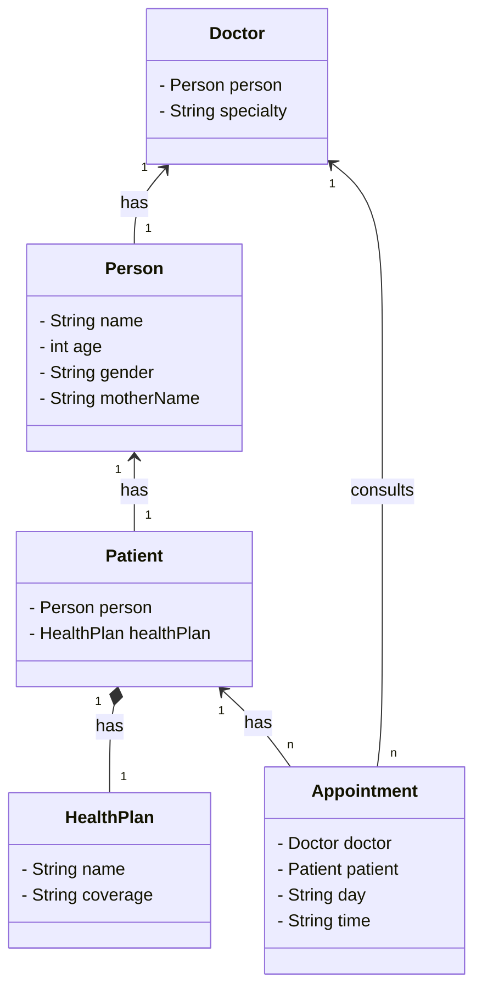

# clinica-medica

## Diagrama de Classes

```mermaid
classDiagram
    class Person {
        - String name
        - int age
        - String gender
        - String motherName
    }
    
    class Patient {
        - Person person
        - HealthPlan healthPlan
    }
    
    class HealthPlan {
        - String name
        - String coverage
    }
    
    class Doctor {
        - Person person
        - String specialty
    }
    
    class Appointment {
        - Doctor doctor
        - Patient patient
        - String day
        - String time
    }
    
    Person "1" <-- "1" Patient : has
    Patient "1" *-- "1" HealthPlan : has
    Doctor "1" <-- "1" Person : has
    Doctor "1" <-- "n" Appointment : consults
    Patient "1" <-- "n" Appointment : has

```
